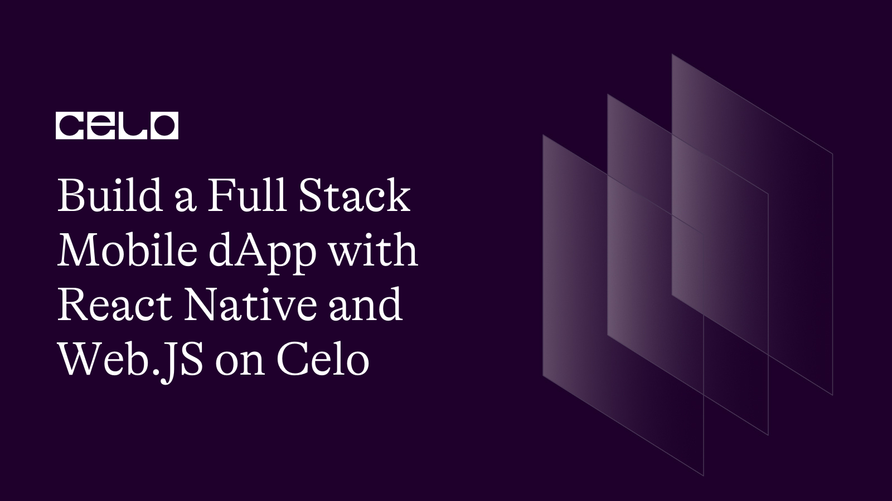
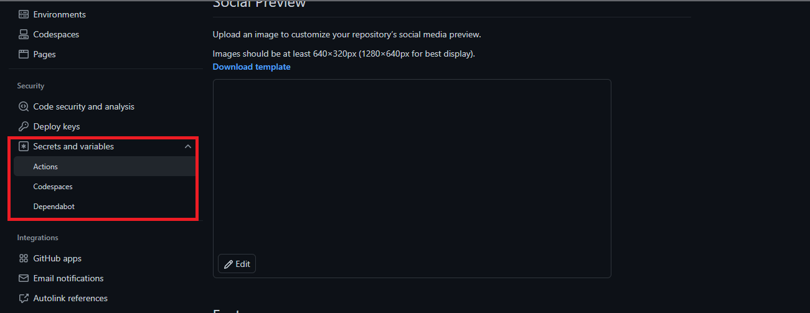
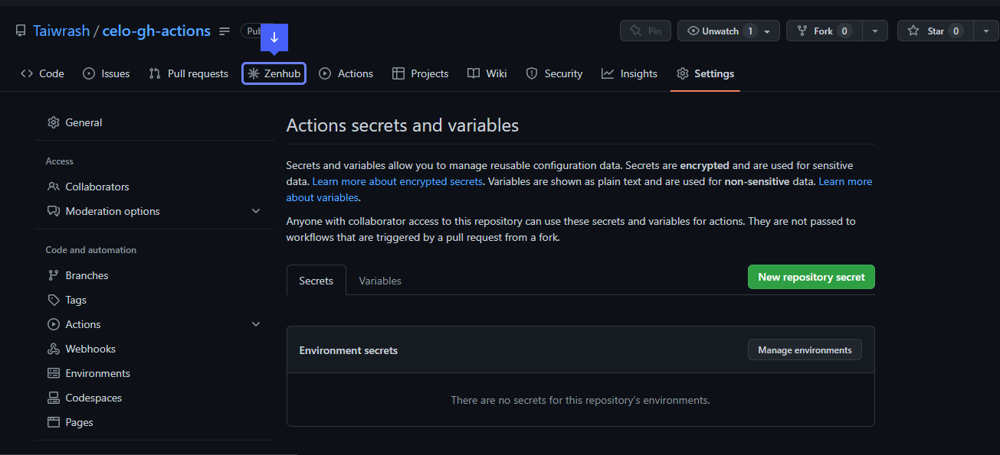
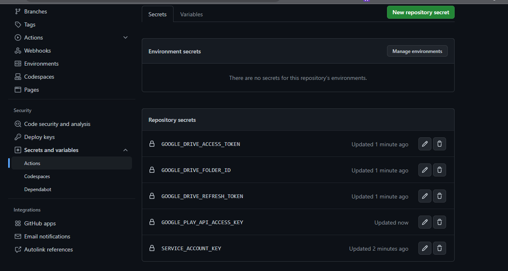
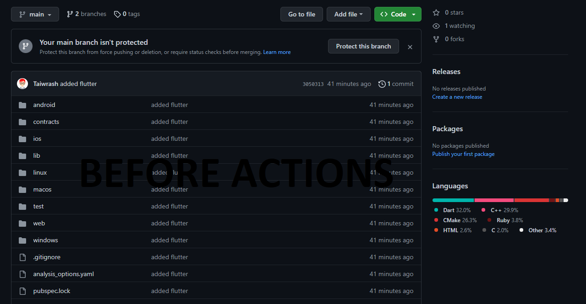

## Introduction

Automation is powerful and cannot be overemphasized in terms of software and problem-solving to increase productivity and ensure powerful releases. The advent of version control systems gives room for collaboration among developers to build solutions. implementing automation to integrate the developers' codes together (continuous integration, or CI), and pushing to release as early as possible, be it on the Google Play store or Google Drive.
In this article, we will be going through the process of setting up an automation system to ensure easy Flutter DApp release and uploading to Playstore or Google Drive using GitHub Actions workflow on GitHub. After successfully building a Celo DApp using Flutter, the next step is making it available to users via the Play Store or Google Drive (for those that do not have a Google Play Account). Doing this will save a lot of time and avoid doing repetitive work manually during updates. In this tutorial, we will be using a Flutter app built by a Celo Sage member. Check out the article [here](https://docs.celo.org/blog/tutorials/build-a-simple-forum-dapp-with-flutter-on-celo) on how to build Flutter DApp. Note that we are not building a Flutter DApp by ourselves. Our job is to make it available to our customers after it has been successfully built by the development team.

## Prerequisite

- Flutter
- A repository of a Celo DApp built with Flutter
- YAML
- GitHub Account
- GitHub Actions

> The list above is the basic knowledge and tools needed to be able to follow along in this tutorial, and a beginner's level of understanding of all this is enough.

## Term Definitions

[GitHub Actions](https://docs.github.com/en/actions): Automate, customize, and execute your software development workflows right in your repository with GitHub Actions. You can discover, create, and share actions to perform any job you'd like, including CI and CD, and combine actions in a completely customized workflow.

[Flutter](https://flutter.dev/): Flutter transforms the app development process. Build, test, and deploy beautiful mobile, web, desktop, and embedded apps from a single codebase.

[DApp](https://www.freecodecamp.org/news/what-is-a-dapp-a-guide-to-ethereum-dapps/): A Dapp, or a decentralized application, is a software application that runs on a distributed network. It's not hosted on a centralized server but instead on a peer-to-peer, decentralized network.

## Getting necessary credentials

It is very clear to us that establishing interactions between two systems (for instance, GitHub and Google Console) requires a lot of verification and authentication to prevent security breaches and ensure privacy. For that reason, we should be able to create an automation system that can easily do this for us. We will be setting up all the credentials needed and focusing on the most important ones to make the work simple for both beginners and advanced readers.

## Setting up the Google Cloud Service JSON Account

A `service JSON account`, sometimes called activity JSON, is a credential or set of data represented in JSON that provides easy interaction with and accessibility to the Google Cloud Platform. It provides access to interact with the Google Play Store, the Google Drive API, and other available resources on GCP. To simplify, here is the link to a [2-minute clip](https://youtu.be/Ls2wkAwXftk) that shows how to do it. After successfully downloading the service account JSON, we can now move on to the next step on how to get our next credential.

## Setting up Google Drive API and Google Play Android Developer API

To set up the Google Drive API and Google Play Android Developer API, the following steps are crucial. Bear in mind that they are very similar to the process of getting service account JSON explained above with just a few tweaks and a different choice of selection, which means the video can be technically followed by choosing the needed and expected service instead, but with the same procedure. The reason I am combining them here is that it is the same process that needs to be followed:

- Step 1: Go to the Google API Console.
- Step 2: Select your project from the drop-down menu in the top navigation bar.
- Step 3: Click on the `Dashboard` button in the left-hand sidebar.
- Step 4: Click on the `+ Enable APIs and Services` button.
- Step 5: Search for `Google Drive API` and click on it. And while creating Play API, choose it here
- Step 6: On the `+ Enable` button
- Step 7: Click on the `Create Credentials` button.
- Step 8: Select "Service Account" as the `Application Type` and click `Continue.`
- Step 9: Enter a name for your service account and click `Create.`
- Step 10: Select the `Editor` role and click `Continue`.
- Step 11: Skip the `Grant users access to this service account` page and click `Done`.
- Step 12: Click on the `Create Credentials` button again and select `Service Account Key`.
- Step 13: Select your service account, select `JSON` as the key type, and click `Create`.
- Step 14: Save the JSON file to your computer.

It is very important to keep all these mentioned JSONs safe for security purposes; anybody who gains access to all the mentioned JSONs can push an app to our platform, and the bill will be on us. For security purposes, let’s pay attention to this very point.

## Let’s Connect the two parties together (GitHub and Google Cloud)

As mentioned, these JSONs are meant to be secrets, and for that reason, we will be leveraging the power of GitHub's security strategy. It is called GitHub Secrets and was purposely made to securely store sensitive information such as your API keys. You can use GitHub's "secrets" feature. These secrets can be used in your workflows to authenticate with external services without revealing your credentials. for easy creation and addition of secrets and API keys. I highlighted simple steps to be followed:

- Step 1: Go to the GitHub repository.
- Step 2: Go to the "Settings" tab of the same repository as shown below
  

- Step 3: Click on the `Secrets` tab in the left-hand sidebar.
  

- Step 4: Click on `New repository secret`.
  

- Step 5: Enter the name and value of the secret. For example, you can create a secret called SERVICE_ACCOUNT_KEY and paste the contents of your JSON key file as the value.
  Repeat this process for the other secrets that you need, such as `GOOGLE_DRIVE_ACCESS_TOKEN`, `GOOGLE_DRIVE_REFRESH_TOKEN`, and `GOOGLE_PLAY_API_ACCESS_KEY`.
  Once you've added all the necessary secrets, you can reference them in your YAML file using the `${{ secrets.SECRET_NAME }}` syntax.

### The final look of our secret page



That's it! With the YAML file and secrets set up, you can now automate the process of uploading your APK file to Google Drive and the Google Play Store every time you make a new release of your Celo dApp.

## The Magic point

This is where the automation part starts, after access to various credentials. It is now time to use them to automate the deployment process and make the magic happen. We will be creating the necessary scripts needed to make all the mentioned actions possible, and to be able to do this, GitHub Actions make it simple for us by just including `.github/workflows/` directories at the root of our Flutter DApp projects.




## Let’s create the actions.

To push GitHub Actions into action, we need to include the set of scripts needed to be executed on our repository in the directories we created. inside the "workflows" folder created in the ".github" folder before. We will create a file; it could be a YAML file or a JSON file, but in this tutorial, we will be using a YAML file. We will be naming the file `deploy.yaml` or `deploy.yml`. Both work the same way; choose a notation that works for you. For easy access, I will be dropping the whole script and explaining it line by line for your understanding.

```yaml
	name: Upload APK to Google Drive and Play Store
	on:
	push:
		branches:
		- main
	env:
	APPLICATION_ID: com.yourcompany.yourapp
	RELEASE_NOTES: "New release"
	APK_PATH: build/app/outputs/flutter-apk/app-release.apk
	jobs:
	deploy:
		runs-on: ubuntu-latest
		steps:
		- name: Checkout
			uses: actions/checkout@v2
		- name: Set up JDK 1.8
			uses: actions/setup-java@v1
			with:
			java-version: 1.8
		- name: Set up Flutter
			uses: subosito/flutter-action@v1
			with:
			channel: "stable"
		- name: Install dependencies
			run: flutter pub get
		- name: Build release APK
			run: flutter build apk --release
		- name: Authenticate Service Account
			uses: google-github-actions/auth@v0.3.0
			with:
			credentials: ${{ secrets.SERVICE_ACCOUNT_KEY }}
		- name: Upload APK to Google Drive
			uses: peaceiris/actions-gdrive@v2.0.4
			with:
			path: ${{ env.APK_PATH }}
			accessToken: ${{ secrets.GOOGLE_DRIVE_ACCESS_TOKEN }}
			refreshToken: ${{ secrets.GOOGLE_DRIVE_REFRESH_TOKEN }}
			folderId: ${{ secrets.GOOGLE_DRIVE_FOLDER_ID }}
		- name: Publish to Google Play
			uses: smeevil/google-play-publish-action@v1
			with:
			# Set the API access key for your Google Play account.
			serviceAccountJson: ${{ secrets.GOOGLE_PLAY_API_ACCESS_KEY }}
			# Set the path to your APK file.
			apkFilePath: ${{ env.APK_PATH }}
			# Set the version code and name for your release.
			versionCode: ${{ github.run_number }}
			versionName: ${{ env.RELEASE_NOTES }}
			# Set the application ID for your app.
			applicationId: ${{ env.APPLICATION_ID }}
```

If you are not familiar with YAML, don’t freak out; it is just a pure data structure following a key-value pair pattern, just like JSON, an array, or a list. I will be going over the most important parts of the scripts for easy understanding:

The `name` field gives a name to the workflow. As the project grows, we may need to automate many tasks beyond deploying to the Play Store or Google Drive; we may need to automate the integration of codes from different developers; we may need to onboard new members to the repository when they create their first issues or make their first pull request. All of this is achievable through GitHub actions. To be able to identify the task that is running or failing, we need a name for it. That is the function of the name field.

The `on` field specifies the events or actions that make the workflow run, in this case when there is a “push” to the main branch. It could happen when a pull request is made or during any other available event on GitHub.

The `env` field sets environment variables that are used throughout the workflow, including the APPLICATION_ID (the package name for your app), RELEASE_NOTES (a brief description of the release), and APK_PATH (the path to your APK file). This could be seen as a variable for beginners because it provides reusability for single declarations.

The `jobs` field defines the jobs that the workflow will run. These are the various related tasks that need to be done. It could be a test job, a lint job, and so on, but in this case, there is only one job called `deploy`.

The `runs-on` field specifies the type of virtual environment to run the job on. In this case, we're using Ubuntu-latest. This is another aspect of GitHub Actions. As Flutter is cross-platform, it can run on Android, iOS, the web, and other platforms. But only Mac users can build iOS, but with the help of GitHub Actions, we can set up a Mac virtual machine with XCode installed that can handle that for us without thinking about getting a Mac Book.

The `steps` field lists the individual steps that the job will run. These include

- Checking out the code
- Setting up Java and Flutter
- Building the release APK
- Authenticating the service account
- Uploading the APK to Google Drive
- Publishing the APK to the Google Play Store, and many more.

The above is the explanation for the fields and key. It is necessary to examine some of the values to better understand them. Below are some explanations of the values of the necessary and important keys:

```yaml
name: Upload APK to Google Drive and Play Store
on:
  push:
    branches:
      - main
env:
  APPLICATION_ID: com.yourcompany.yourapp
  RELEASE_NOTES: "New release"
  APK_PATH: build/app/outputs/flutter-apk/app-release.apk
```

The above contains three keys: `name`, `on`, and `env`, and a subkey under `on` that is `push`, which in turn has a subkey `branches` with a value of `main`. It is important to note at this point that the subkeys are values for the parent key, and they always expect their own value. The structure means that when a push is made to the main branch, it executes the upcoming jobs that we will be having. The “env” variable stores the value of other values that needed to be reused along the way in the workflow. In this case, it contains the `Application_id`, `Release_notes`, and the `APK_PATH`. We will use all these values along the way. The `name` key has a direct value, the name of the workflow.

```yaml
jobs:
  deploy:
    runs-on: ubuntu-latest
    steps:
      - name: Checkout
        uses: actions/checkout@v2
      - name: Set up JDK 1.8
        uses: actions/setup-java@v1
        with:
          java-version: 1.8
      - name: Set up Flutter
        uses: subosito/flutter-action@v1
        with:
          channel: "stable"
      - name: Install dependencies
        run: flutter pub get
      - name: Build release APK
        run: flutter build apk --release
      - name: Authenticate Service Account
        uses: google-github-actions/auth@v0.3.0
        with:
          credentials: ${{ secrets.SERVICE_ACCOUNT_KEY }}
      - name: Upload APK to Google Drive
        uses: peaceiris/actions-gdrive@v2.0.4
        with:
          path: ${{ env.APK_PATH }}
          accessToken: ${{ secrets.GOOGLE_DRIVE_ACCESS_TOKEN }}
          refreshToken: ${{ secrets.GOOGLE_DRIVE_REFRESH_TOKEN }}
          folderId: ${{ secrets.GOOGLE_DRIVE_FOLDER_ID }}
```

The `jobs` key has a single direct subkey (value), and it is the `deploy` job. In this section, we need a series of actions and tasks to deploy. For us to be able to deploy, we need a virtual environment to run our codes, just as we will do on our local machine. We are using `ubuntu-latest` here, which is the `runs-on` key function. followed by a series of steps, and each step is given a name for easy tracing in case of any issues or updates. The first thing to do is check out the code from the GitHub repository on the virtual machine we are running on. This is abstracted away by a package (`actions/checkout@v2`) built by the GitHub action team with the help of the `uses` key. This will be repeated for every task and job if it requires more than one job, as in our case.

The `with` specifies the dependencies that are required and needed to execute the defined task at that level. with the help of packages that can all be gotten from the GitHub Actions Marketplace. And lastly, let’s talk about accessing secrets in our YAML file. To do this, we will be using the keyword `secrets` with a dot (`.`) and attaching the name of the key we use in creating the GitHub secrets in one of the sections above.

Summarily, the whole sample code can be gotten from the marketplace, and we can modify it to suit our goals and what we want to achieve, and a closer look will reveal how some Flutter commands that we normally execute in our local machine are executed to make this possible.

## Conclusion

After successfully following the tutorial as it is on this [repository](https://github.com/Taiwrash/celo-gh-actions), I believe you’ve been able to deploy your DApp to both Google Drive and the Google Play Store, and apart from that, you’ve been able to learn YAML and how to use YAML to configure the GitHub Actions to kick start the process of deployment through automation.

## About the author

My name is Rasheed Mudasiru, and I'm a software developer, passionate about community building based in Nigeria. I have recently been experimenting with DevOps and blockchain promotions.
