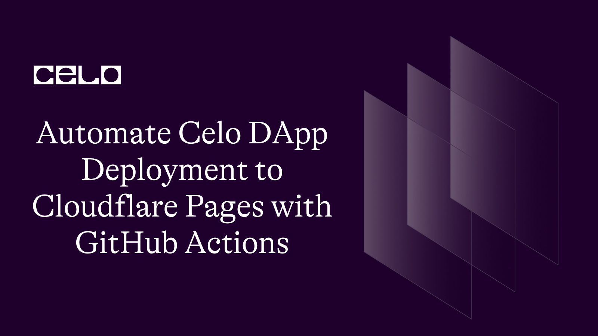
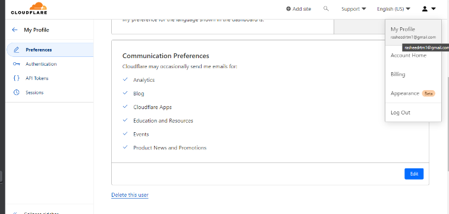
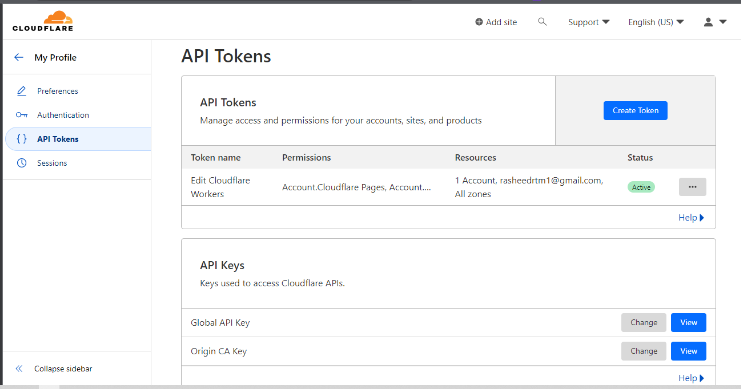
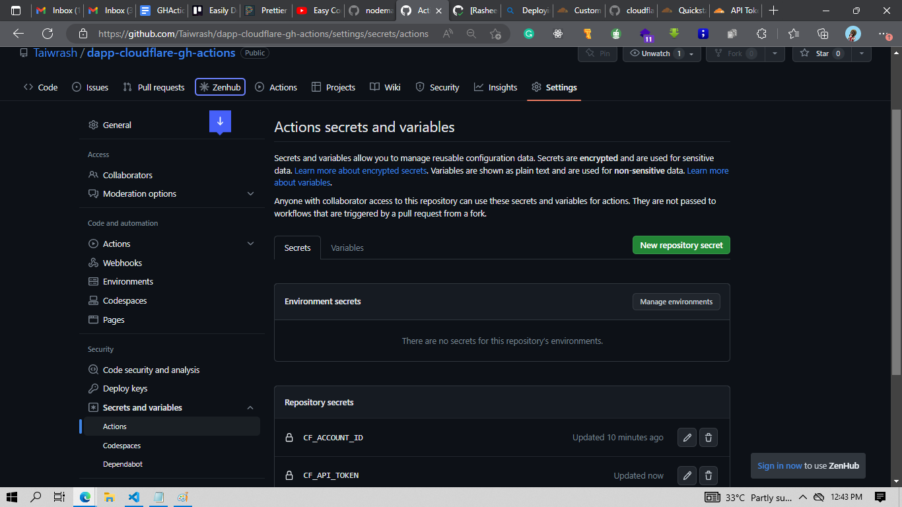

Any software development life cycle is not complete until the product or solution the development teams are building reaches the customers. For this to be possible, there is a need for a series of setup and configuration steps to create an environment to run the solution and make it accessible to all the customers as needed. Solution Reaching the customer is not enough, as it is important to consider the rate at which it reaches them in due time. This is why automation is necessary to speed up the rate of product release to market through a simple and stress-free method. This could be made possible with the help of a version control system. Every code push to this system can be tracked and automatically delivered to our customers with the help of a powerful automation tool called GitHub Actions, which can help us deliver our product to the various platforms where we are hosting it. In this tutorial, we will be focusing on Cloudflare, but the steps can be adopted for other similar platforms like Heroku, Digital Ocean, and so on. As usual, we will be using one of the articles written by one of the members of the Celo Sage community, as this article will be focusing on deploying Celo DApps on Cloudflare.

## Prerequisite

GitHub Account
Celo DApp code repository (This is our complete repository)
Cloudflare Account
Knowledge of YAML

Knowledge of YAML is not compulsory to follow in this tutorial, but it is a plus to be able to easily grasp the concepts.

## Setting up Cloudflare Account

Because this article is not for absolute beginners, I will not be explaining how to create an account on Cloudflare. I recently published an article on Celo Sage that focused on getting started with Cloudflare, with step-by-step instructions on how to create an account and get your DApp running manually. The goal of this article is to automate that process with GitHub Actions and avoid having to perform repetitive tasks manually. So check it out.

## Setting the DApp repository

It is also important to note, once again, that we are not building DApps by ourselves. Our job in this article is to deploy the already-built DApp, and in this article, we are using a public React-based DApp. You can follow the below steps to get it on your local machine and get it to your personal repository to be suitably personalized and perform the magic independently of the original work.

## Clone and push code to GitHub

Clone your Celo DApp code repository to your local machine.
Make any necessary changes to the code as a personal reference. On a normal may feel to recompile the contract but with the future steps we don’t need it we will do it automatically using the power of automation brought to us by GitHub Automation
Create a GitHub repository to store your code and push your changes to it.

- Setting up GitHub Actions for the DApp
  You just committed and pushed your edited DApp to GitHub, and you’ve confirmed it is up and running. Then let’s set up the magic of GitHub Actions. In your text editor do the following tasks

Create a `.github/workflows` directory if it does not exist before now.
Create a new file in this directory with any name you preferred, but make sure it has the extension `.yml` or `.yaml`. In our case, we could name it `deploy.yml` or `deploy.yaml`.
Open the file and paste in the below yaml script to handle the magic for us as shown in the code below

```yaml
name: Deploy DApp to Cloudflare with GH Actions

on: [push]

jobs:
  publish:
    runs-on: ubuntu-latest
    permissions:
      contents: read
      deployments: write
    name: Publish to Cloudflare Pages
    steps:
      - name: Checkout
        uses: actions/checkout@v3

      # Run a build step here if your project requires
      - name: Install dependencies
        run: npm install

      - name: updating
        run: npm update --latest react-scripts

      - name: Build DApp
        run: |
          npm run build
        #  echo "Build successful"

      - name: Publish to Cloudflare Pages
        uses: cloudflare/pages-action@v1
        with:
          apiToken: ${{ secrets.CF_API_TOKEN }}
          accountId: ${{ secrets.CF_ACCOUNT_ID}}
          projectName: /
          directory: build
        id: publish
      - name: Outputs
        run: |
          echo "ID: ${{ steps.publish.outputs.id }}"
          echo "URL: ${{ steps.publish.outputs.url }}"
          echo "Environment: ${{ steps.publish.outputs.environment }}"
          echo "Alias: ${{ steps.publish.outputs.alias }}"
```

Remember to save it but before you commit and push to GitHub go through what this will do for us.

## Code explanation

As it has been mentioned earlier, this is a YAML document, and YAML is a kind of data structure that is simple to read and understand when making a script with it.

It is important to note that the workflow can also be in JSON format other than YAML, but YAML format is widely accepted when writing DevOps automation processes.

Updated the Deploy to Cloudflare step to use the Cloudflare Pages GitHub Action instead of the Wrangler Action, and specified the build directory where your production-ready Celo DApp is generated. You'll also need to provide your Cloudflare Pages site ID and API token in order to deploy your app to Cloudflare.

```yaml
name: Deploy Celo DApp on Cloudflare Pages
on:
  push:
    branches:
      - main
```

This is the name of the workflow and specifies the trigger for the workflow. In this case, the workflow is triggered when changes are pushed to the "main" branch of the GitHub repository. Remember, you can specify as many branches as possible and as well add the event to listen to, whether a push or pull request is made to a particular branch.

```yaml
jobs:
  build-and-deploy:
    runs-on: ubuntu-latest
```

This part explains the job that the workflow will perform. The job is named "build-and-deploy" (this could be a name, and you can be creative to come up with something that other people can relate to), and it will run on an Ubuntu operating system. This will serve as a hosted system, and GitHub Actions automatically creates one, which we are installing the latest on. This is called a “runner.".

```yaml
   steps:
    - name: Checkout code
      uses: actions/checkout@v3

    - name: Install dependencies
      run: npm install

    - name: Build DApp
      run: npm run build

 - name: Outputs
        run: |
          echo "ID: ${{ steps.publish.outputs.id }}"
          echo "URL: ${{ steps.publish.outputs.url }}"
          echo "Environment: ${{ steps.publish.outputs.environment }}"
          echo "Alias: ${{ steps.publish.outputs.alias }}"

```

The following are the steps that the job will take: The steps include:

Checking out the code from the GitHub repository. It means to clone and copy our source code to our runner and has it the way we did on our local machine.
Installing the dependencies for the DApp. We all know to install dependencies in the Nodejs environment. We simply run “npm install”
Building the DApp. To run build for our Reaact DApp. We will create a new step under the steps, give it a name and run the test.
Deploying the DApp to Cloudflare task was created
The API token is passed as a secret, and the environment is set to `production`.
This step deploys the built DApp to Cloudflare Pages using the `cloudflare/pages-action@v1` GitHub Action.
Overall, this is the explanation of the YAML file, which points to the GitHub Actions workflow that builds and deploys a Celo DApp to Cloudflare whenever changes are pushed to the `main` branch of the associated GitHub repository.

Let’s talk about how to get the token API and other Credentials and Add them to GitHub Secrets

It is a known vulnerability to have private keys exposed on the internet, even outside of GitHub. That is why the team at GitHub created secrets for storing keys like that.

- Step 1: Go to your Cloudflare dashboard, click on the picture in the right-hand corner, and select Profile.



- Step 2: Select the API Token tab. In your own case, you may not have the one you can see below. It is because this is your first. Click “Create Token." Remember to select Get started with custom, fill out the form, click on `continue to the summary`, and you will have access to copy the token key.



- Step 3: Add this key to GitHub Secrets. Follow the screenshot below under your repository settings. Make sure you use the names you indicated on your action script.



- Step 4: Now we can now commit and push our update to GitHub and wait for the Actions to handle the rest while we watch it flow.

Congratulate yourself as the process completes with a green check mark on your GitHub repository, and you can easily navigate to the Cloudflare dashboard and grab the link generated. That’s the link to your deployed DApp.

## Conclusion

Deploying your Celo DApp on Cloudflare Pages can greatly enhance its availability and performance. With Cloudflare Pages, you can easily deploy and manage your web applications using a variety of tools and features. In this process, you learned how to use GitHub Actions to automatically build and deploy your React-based Celo DApp to Cloudflare Pages. You also learned how to store your API token and Zone ID securely in your repository's secrets.

By following the steps outlined in this guide, you should be able to deploy your Celo DApp to Cloudflare Pages with ease. With your DApp deployed on Cloudflare Pages, you can enjoy increased scalability, faster load times, and improved reliability for your users. See [repo link here](https://github.com/Taiwrash/dapp-cloudflare-gh-actions)

## About the author

My name is Rasheed Mudasiru, and I'm a software developer passionate about community building based in Nigeria. I have recently been experimenting with DevOps and blockchain promotions.
